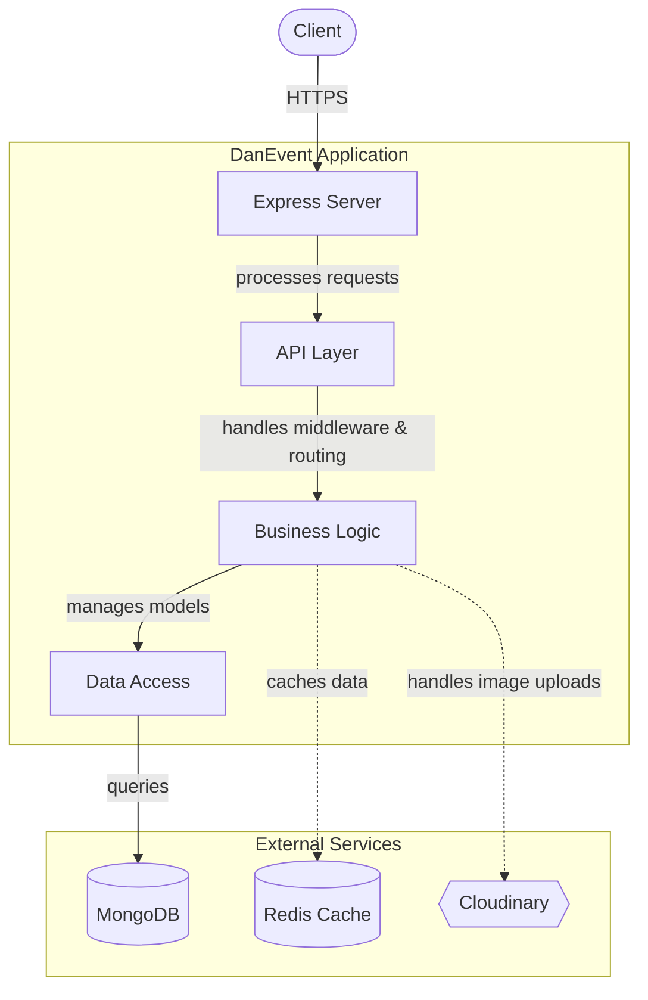

# DanEvent System Architecture

High-level architectural overview of the DanEvent backend server — its components, layer interactions, and key design decisions.

The DanEvent server is a RESTful API built on Express and MongoDB that manages events, user accounts, and event bookings. It follows a modular, middleware-driven architecture with Redis-based caching, Cloudinary integration for image storage, and JWT-based authentication with role-based access control. This document describes how these components fit together and communicate at a system level.

## Architecture

The system follows a layered architecture with clear separation of concerns. Incoming HTTP requests flow through a chain of middleware layers before reaching route handlers, which interact with models and services to fulfill requests.

### System Diagram



### Request Lifecycle

1.  **HTTP Layer** — Requests arrive at the Express server configured in `index.js`. Global middleware applies CORS headers, Helmet security headers, JSON body parsing, and rate limiting (100 requests per 15-minute window per IP).
2.  **Middleware Layer** — Route-level middleware handles authentication (`middlewares/auth.js`), file uploads (`middlewares/upload.js`), and cache reads (`middlewares/cache.js`). The auth middleware verifies JWT tokens and enforces role-based access (admin or user).
3.  **Route Layer** — Two routers handle all API endpoints: `routers/users.js` (registration, login, profile management, role toggling, account deletion) and `routers/events.js` (CRUD operations, bookings, category listing).
4.  **Data Layer** — Mongoose models (`models/user.js`, `models/event.js`, `models/booking.js`) define schemas and validation logic. Data is persisted in MongoDB, connected via `config.js`.
5.  **Service Layer** — `services/cloudinaryService.js` provides a singleton for image upload and deletion operations. `utils/redis.js` exposes the ioredis client used by the caching middleware.
6.  **Error Handling** — `shared/APIError.js` provides a standardized error class with HTTP status, title, and message serialization, ensuring consistent error responses across all endpoints.

### Key Design Decisions

| Decision | Rationale |
|---|---|
| **Redis cache-aside pattern** | The `cache()` function in `middlewares/cache.js` wraps database queries with configurable TTL values, reducing MongoDB load for frequently accessed resources (events: 120s, categories: 900s, users: 120s). |
| **Singleton CloudinaryService** | Ensures a single, shared Cloudinary client instance across the application, avoiding redundant SDK initialization. |
| **Factory-pattern auth middleware** | `middlewares/auth.js` exports a factory function that accepts a roles array, enabling flexible role-based access control per route (e.g., `auth(['admin'])` for admin-only endpoints). |
| **Joi validation at model level** | Each Mongoose model file exports validation functions (`validateUser`, `validateEvent`, `validateBooking`) using Joi schemas, keeping validation logic co-located with data definitions. |
| **Rate limiting at API prefix** | The rate limiter is applied to the `/api` prefix before routes are mounted, protecting all endpoints uniformly. |

### Component Interaction

- **`index.js`** imports `config.js` for database connection and port configuration, then mounts `routers/users.js` at `/api` and `routers/events.js` at `/api/events`.
- **Route handlers** import models, the cache middleware, the Cloudinary service, and the Redis client directly. Auth-protected routes compose the `auth()` middleware factory.
- **`config.js`** manages the MongoDB connection via `connectToDatabase()` and applies global response headers through `globalResponseHeaders()`.
- **`config/cloudinary.js`** configures the Cloudinary SDK using environment variables, consumed by `services/cloudinaryService.js`.

## Project Structure

```
DanEvent/
├── config/
│   └── cloudinary.js          # Cloudinary SDK configuration from env vars
├── middlewares/
│   ├── auth.js                # JWT verification + role-based access control
│   ├── cache.js               # Redis cache-aside helper with configurable TTL
│   └── upload.js              # Multer-based file upload (single, event, profile)
├── models/
│   ├── booking.js             # Booking schema, model, and Joi validation
│   ├── event.js               # Event schema, model, and Joi validation
│   └── user.js                # User schema, model, JWT token generation, and validation
├── routers/
│   ├── events.js              # Event CRUD, bookings, categories, filtering, pagination
│   └── users.js               # User registration, login, profile, roles, deletion
├── services/
│   └── cloudinaryService.js   # Singleton for image upload/deletion via Cloudinary
├── shared/
│   └── APIError.js            # Standardized HTTP error class with serialization
├── utils/
│   └── redis.js               # ioredis client initialization and event listeners
├── config.js                  # Express config, MongoDB connection, CORS, port
├── index.js                   # Application entry point and server bootstrap
├── package.json               # Dependencies and scripts
└── package-lock.json          # Locked dependency tree
```

### Component Responsibilities

| Directory | Purpose |
|---|---|
| `config/` | External service configuration (Cloudinary SDK setup). |
| `middlewares/` | Reusable Express middleware for authentication, caching, and file uploads. |
| `models/` | Mongoose schemas and models with co-located Joi validation functions. |
| `routers/` | Express route definitions and request handlers for each API resource. |
| `services/` | Business logic abstractions (image operations) exposed as reusable singletons. |
| `shared/` | Cross-cutting utilities like standardized error handling. |
| `utils/` | Infrastructure clients (Redis) with environment-based configuration. |

### Entry Point

`index.js` is the application entry point. It initializes Express, applies global middleware (CORS, Helmet, JSON parsing, rate limiting), mounts route modules, connects to MongoDB via `config.connectToDatabase()`, and starts listening on the configured port.

```javascript
// Minimal startup sequence
const config = require('./config');
const users = require('./routers/users');
const events = require('./routers/events');

app.use('/api', apiLimiter);
app.use('/api', users);
app.use('/api/events', events);

config.connectToDatabase();
app.listen(config.PORT);
```