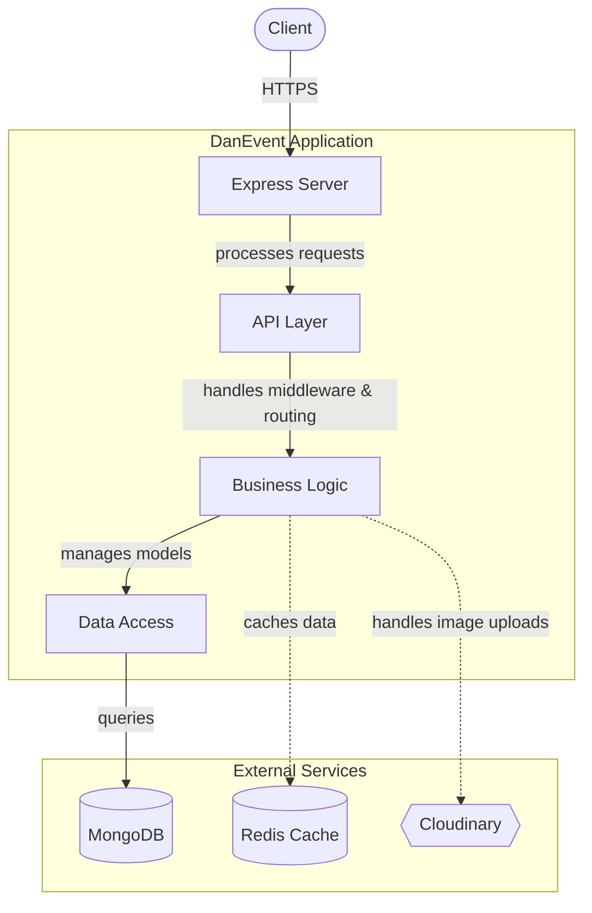
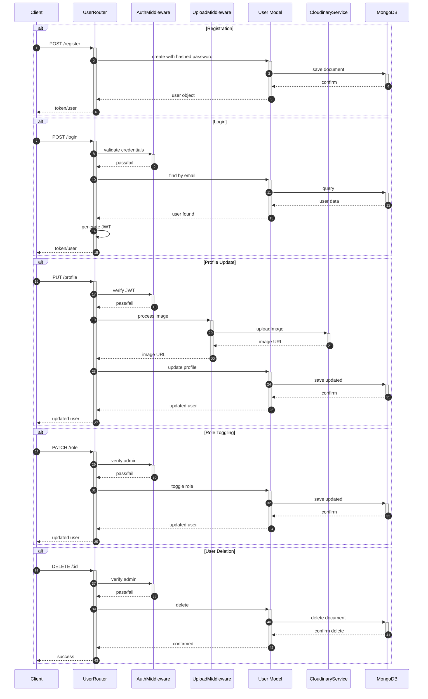
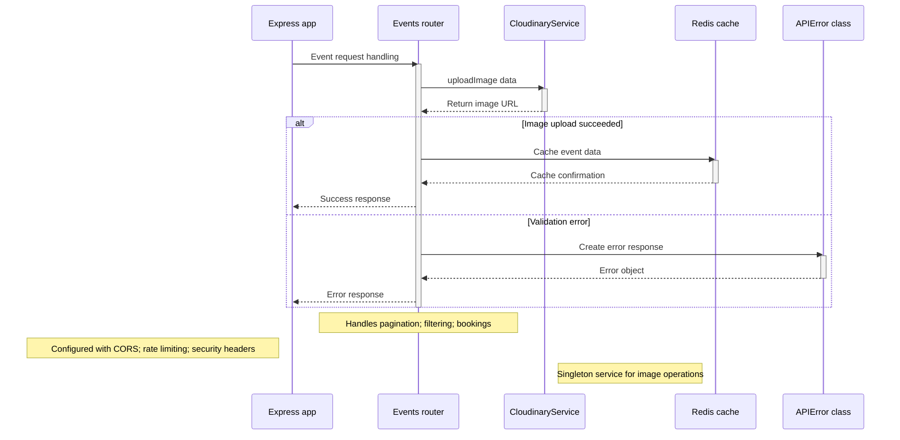

# Contributing Guidelines

Guidelines for contributing to the DanEvent backend server.

DanEvent is a Node.js/Express backend for event management, featuring user authentication, event CRUD, booking workflows, and Redis-based caching. Contributions should align with the existing project structure and coding conventions described below. For architectural context, refer to the [System Architecture](ARCHITECTURE.md) document.

## Development

### Prerequisites

- **Node.js** (v18 or later recommended)
- **npm** package manager
- **MongoDB** instance (local or remote)
- **Redis** instance (for caching layer)
- **Cloudinary** account (for image uploads)

### Environment Setup

1. Fork and clone the repository:

```bash
git clone https://github.com/<your-username>/DanEvent.git
cd DanEvent
```

2. Install dependencies:

```bash
npm install
```

3. Create a `.env` file at the project root with the following variables (as referenced in `config.js` and `utils/redis.js`):

```env
PORT=3000
MONGODB_URI=mongodb://localhost:27017/danevent
REDIS_HOST=127.0.0.1
JWT_SECRET=your_jwt_secret_here
CLOUDINARY_CLOUD_NAME=your_cloud_name
CLOUDINARY_API_KEY=your_api_key
CLOUDINARY_API_SECRET=your_api_secret
```

4. Start the development server:

```bash
npm start
```

The server entry point is `index.js`, which initializes Express, configures middleware (CORS, Helmet, rate limiting), mounts user routes at `/api` and event routes at `/api/events`, connects to MongoDB, and begins listening on the configured port.

For development with auto-restart on file changes:

```bash
npx nodemon index.js
```

### Project Structure

Familiarize yourself with the directory layout before making changes:

```
├── config/            # External service configuration (Cloudinary)
├── middlewares/        # Express middleware (auth, cache, upload)
├── models/            # Mongoose schemas (User, Event, Booking)
├── routers/           # Route handlers (users, events)
├── services/          # Service classes (CloudinaryService)
├── shared/            # Shared utilities (APIError)
├── utils/             # Infrastructure clients (Redis)
├── config.js          # App-level config (DB, CORS, headers)
└── index.js           # Entry point
```

### Code Style

- The project uses **CommonJS** (`require`/`module.exports`) throughout.
- Route handlers use async/arrow function syntax.
- Validation is handled via **Joi** schemas defined alongside Mongoose models in the `models/` directory.
- Errors are standardized using the `APIError` class from `shared/APIError.js` and serialized with its `toJSON()` method.
- The `debug` module (`app:development` namespace) is used for development logging.

### Architecture Overview

The following diagrams illustrate the system structure and key interaction flows. Detailed architectural rationale is documented in [ARCHITECTURE.md](ARCHITECTURE.md).







## Testing

The project currently does not include a configured test suite. The `test` script in `package.json` is a placeholder:

```bash
npm test
# Output: "Error: no test specified" and exit 1
```

### Adding Tests

When adding tests, follow these conventions:

- Place test files in a `tests/` directory at the project root (create if needed).
- Name test files using the pattern `<module>.test.js` (e.g., `users.test.js`, `events.test.js`).
- The project's dependencies include `express` and `mongoose` — consider integration testing with an in-memory MongoDB instance (e.g., `mongodb-memory-server`).
- Add any test framework (e.g., Jest, Mocha) as a `devDependency`.
- Update `package.json` scripts to wire the test runner:

```json
"scripts": {
  "test": "jest",
  "test:watch": "jest --watch"
}
```

### What to Test

Priority areas for test coverage:

- **Model validation** — Joi schemas in `models/user.js`, `models/event.js`, and `models/booking.js` with their `validate*` functions.
- **Route handlers** — endpoint logic in `routers/users.js` and `routers/events.js`.
- **Middleware** — JWT verification and role-based access in `middlewares/auth.js`.
- **Error handling** — `APIError` serialization in `shared/APIError.js`.

## Contributing

### Workflow

1. **Fork** the repository and create a feature branch from `main`.
2. Make changes following the conventions described above.
3. Ensure the server starts without errors (`npm start`).
4. Write or update tests if applicable.
5. Commit changes with a descriptive message.
6. Open a pull request against the upstream `main` branch.

### Commit Messages

Use clear, imperative commit messages that describe the change:

- `Add email validation to User model`
- `Fix booking duplicate check in events router`
- `Update CloudinaryService to handle deletion errors`
- `Add caching middleware for event categories`

### Pull Request Guidelines

- Keep PRs focused on a single concern.
- Describe what the change does and why in the PR description.
- Reference any related issues where applicable.
- Ensure no hardcoded secrets or credentials are committed.

### Reporting Issues

Report bugs or feature requests via the repository's issue tracker. Include:

- Steps to reproduce the issue.
- Expected vs. actual behavior.
- Relevant environment details (Node.js version, OS, database version).

### Areas for Contribution

- **Test coverage** — the project has no tests; adding them is a high-priority contribution.
- **Error handling** — standardize all route handlers to use `APIError` for consistent error responses.
- **Documentation** — improve inline comments and expand the API documentation (`api_documentation.yaml`).
- **Input validation** — review and tighten Joi schemas across all models.