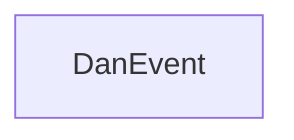

# DanEvents

A modular event management platform.

DanEvents is a project designed to handle event-related workflows and operations. As the project evolves, additional details about its core capabilities and intended use cases will be documented here.

## System Architecture

DanEvent is currently the sole service in this project. As additional repositories are introduced, this section will be updated to reflect inter-service interactions.

## Services / Components

### DanEvent (Main Service)

| Attribute | Value |
|-----------|-------|
| **Repository** | [Daniel-Sameh/DanEvent](https://github.com/Daniel-Sameh/DanEvent) |
| **Role** | Primary service |
| **Description** | Core service for the DanEvents project |

Additional technical details — including primary languages, frameworks, and deployment instructions — are available in the [repository's own README](https://github.com/Daniel-Sameh/DanEvent).

## Communication Patterns

Inter-service communication patterns have not yet been characterised. Refer to each service's own README for integration details.

## Getting Started

Please refer to the [DanEvent repository](https://github.com/Daniel-Sameh/DanEvent) for setup instructions, configuration, and usage documentation.