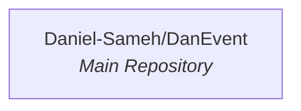

# DanEvents

A singular repository project — currently the sole service.

DanEvents is a project whose primary repository is **DanEvent**. At present, the codebase consists of a single repository with no sibling services or defined cross-repository communication patterns. Detailed information about the repository's purpose, languages, and technology stack has not been provided in the available context.

---

## System Architecture

The project currently comprises a single repository. There are no inter-service dependencies or outbound/inbound call relationships to document.

---

## Services / Components

### DanEvent *(Main Service)*

| Attribute | Value |
|---|---|
| **Repository** | `Daniel-Sameh/DanEvent` |
| **Description** | *(not provided)* |
| **Primary Language(s)** | *(not provided)* |
| **Tech Stack** | *(not provided)* |

This is the sole repository in the project. Further details should be added as the project evolves and additional repositories, languages, and technology choices are committed to this codebase.

---

## Communication Patterns

Inter-service communication patterns have not yet been characterised. Refer to each service's own README for integration details.